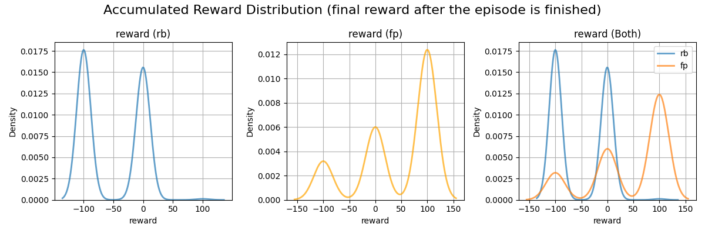
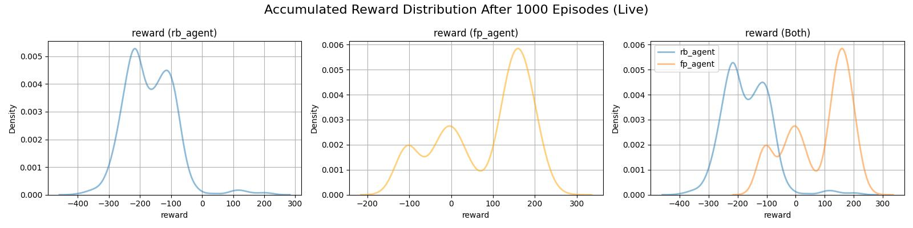
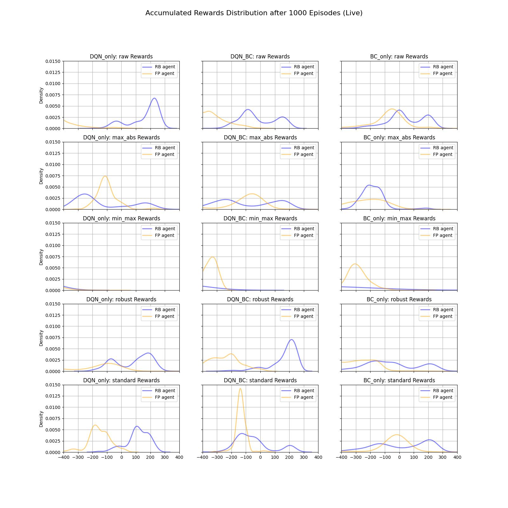

# Offline Reinforcement Learning
## TODO: write a good subtitle

## Introduction

Offline Reinforcement Learning (Offline RL) learns policies from a fixed dataset, without interacting with the environment during training. This is useful when online interaction is costly, unsafe, or impractical.

However, removing exploration introduces major challenges, such as extrapolation error in value-based methods and a strong dependence on dataset composition and coverage. In particular, high-quality datasets collected from near-optimal or converged policies often lack sufficient state-action diversity and sub-optimal transitions, which are crucial for stable learning in Temporal Difference (TD)-based RL.

Modern approaches such as DQN+BC and TD3+BC address these issues by combining RL with Behavior Cloning (BC) regularization, merging RL and supervised learning in a deep learning setting.

This project investigates DQN+BC in the [Lunar Lander](https://gymnasium.farama.org/environments/box2d/lunar_lander/) environment and:
- Separates BC pretraining from DQN+BC training;
- Studies the impact of state normalization;
- Confirms that replay buffer (RB) datasets collected during online training outperform final policy (FP) datasets collected from near-optimal policies, due to higher diversity, exploration, and the presence of sub-optimal transitions.

---

## Outline
- [Contributions](#contributions)
- [Datasets](#datasets)
- [State Normalization Techniques](#state-normalization-techniques)
- [Experimental Setup](#experimental-setup)
- [Results](#results)
- [Limitations](#limitations)
- [How to Run this Project?](#how-to-run-this-project?)


---

## Contributions
This project makes three main contributions to the study of offline DQN+BC and offline RL in general, focusing on training strategies, state representation, and dataset composition.

### Decoupled BC and DQN+BC Training
Standard DQN+BC implementations train the BC agent and Q-function together. This has its benefits but also creates some problems:
* __Pros__: It is simple, fast and does not require separate pipelines for training two separate agents;
* __Cons__: BC and RL have different training needs - RL benefits from small, noisy mini-batches, while BC requires larger batches and relatively stable loss gradients. This can make early BC updates unstable when trained jointly;

In this project, BC is trained first and then used in DQN+BC. This allows BC and RL to use different training strategies, such as separate pruning, early stopping, and batch sizes. Furtheremore, starting DQN+BC with a fully trained BC model improves stability and performance from the very first mini-batch, avoiding the initial “burn-in” period of joint training. The trade-off is a slightly higher computational cost and added implementational omplexity due to separate training pipelines.


### State Normalization Study
Offline RL is sensitive to the distribution of states in the dataset, and feature normalization can help improve stability and performance. This project evaluates five state normalization methods: raw (no normalization), max-abs, min-max, robust, and standard (z-score).

The goal is to test whether normalizing states improves performance and to identify which normalization techniques work best in offline DQN+BC.


### Confirm Dataset Quality Diversity Trade-off
Prior works have shown that RB datasets, which contain diverse state-action pairs, suboptimal transitions and reflect more "exploratory" behavior, often outperform FP datasets collected from fully trained agents with mostly optimal actions.

This project tests this observation in the [Lunar Lander](https://gymnasium.farama.org/environments/box2d/lunar_lander/) environment and provides insights into why dataset diversity and the presence of suboptimal transitions improve offline DQN+BC performance.

---

## Datasets
To test the hypotheses, each agent is evaluated across 10 variations: 5 normalization methods × 2 datasets. The datasets are:

* __Replay Buffer (RB) Dataset__ – Captures the agent’s learning experience throughout training in a typical online setting;

* __Final Policy (FP) Dataset__ – Generated using the fully trained DQN agent’s final policy;

> [!NOTE]
> The datasets used in this project were provided by my supervisor as part of the task description.

A full statistical analysis of the training subsets used for RB and FP can be found in the notebook:

```Data Exploration
notebooks/data_exploration.ipynb
```

---

## State Normalization Techniques
In adition to the Raw state-action pairs the following 4 normalization techniques were systematically tested and evaluated for each agent variation:

- Min-Max [0,1] – Scales each feature to the [0,1] range:

$$x^\prime = \frac{x - x_{min}}{x_{max} - x_{min}}$$

- Max-Abs[-1;1] - Scales features by their maximum absolute value. Preserves zeros and negative values:

$$x^\prime = \frac{x}{|x_{max}|}$$


- Standard (z-score) - Centers features to mean 0 and standard deviation 1:

$$ x^\prime= \frac{x - x_{mean}}{\sigma + \epsilon} $$

> [!Note] 
> To avoid division by 0 a small positive constant $\epsilon=10^{-6}$ was added to the denominator.

- Robust - Scales features using median and interquartile range (IQR). Makes the models less sensitive to outliers:

$$ x^\prime = \frac{x-x_{median}}{x_{Q3} - x_{Q1}} $$


> [!Note] 
> Normalization statistics (e.g. mean, standard deviation, min/max) were computed separately for the RB and FP datasets using a training subset, and then kept fixed during agent training.

---

## Experimental Setup


### Environment
All experiments were conducted in the LunarLander-v2 environment with an 8-dimensional continuous state space and a discrete action space with four actions controlling the lander’s engines. Episodes end after successful landing, crash, or timeout, with a shaped reward function that encourages safe landings and fuel efficiency. More information about the environment, states, actions and reward structure can be found in:

 ```Info about the Environment
notebooks/data_exploration.ipynb
 ```

Although the environment is deterministic, each episode starts from a randomized initial state, with small variations in position, velocity, and angular velocity. This makes LunarLander-v2 well suited for analyzing extrapolation error in offline RL.

### Algorithms and Variations
Three Q-learning variants were evaluated: 
- DQN-only ($\tau = 0$): ignores the BC policy; 
- DQN+BC: the hyperparameter $\tau$ controls the strength of BC regularization by constraining the Q-update toward dataset actions;
- BC-only ($\tau = 1$): the Q-networks are trained using only the action predicted by the BC policy. 


Each variant was tested with five state representations (raw plus four normalization methods), resulting in 15 agents per dataset and 30 agents in total. All BC models were trained separately before DQN+BC training.
 

### Evaluation
BC agents were evaluated on held-out test subsets to measure how well they mimic the behavior of the original online DQN agent, using balanced accuracy as the metric. The best BC model for each dataset (RB and FP respectufully) was also evaluated in the live environment over 1000 seeded episodes.  

DQN+BC agents were evaluated exclusively in the live environment over 1000 seeded episodes, with performance assessed using the kernel density estimation (KDE) of total episode returns.


---

## Results

### Online Agent Reward Distributions (RB vs FP)
Both datasets produce multimodal reward distributions with relatively high variance. This indicates that the mean reward alone is not a reliable summary statistic, and that comparing full reward distributions is necessary to properly evaluate agent performance.




### BC Performance on the Test Subsets and in the Live Environment
BC trained on the FP dataset clearly outperforms BC trained on RB. FP BC closely imitates a single near-optimal policy, while RB BC struggles due to higher variance and policy mixture in the dataset. This is reflected both in live-environment rewards and imitation accuracy.

| BC Agent Type | Balanced Accuracy (Test)| Macro Recall (Test) | Macro F1 (Test) |
|----------|----------|----------|----------|
| RB BC   | 0.56  | 0.56   | 0.51   |
| FP BC   | 0.98  |  0.98   | 0.96   |

More results on the test subsets including but not limited to confusion matrices, class-specific evaluation metrics and more can be found in:
``` All evaluation metrics results for BC
notebooks/BC/BC_evaluation.ipynb
```


FP BC achieves almost perfect imitation, while RB BC performs significantly worse. This gap highlights the increased difficulty of cloning behavior from a diverse, multi-policy dataset.




### Offline DQN+BC Performance Across Datasets and Normalizations

Despite weaker BC performance, RB-based DQN+BC agents consistently outperform FP-based ones across all normalization strategies and algorithm variants. The best overall performance is achieved with DQN+BC using robust normalization on the RB dataset.

This confirms prior works` findings that dataset diversity is more important than BC imitation quality alone in offline RL. RB datasets provide wider state-action coverage and include sub-optimal transitions, which reduce extrapolation error and improve the stability of TD-based learning. In contrast, FP datasets lack such diversity and expose the agent to fewer sub-optimal signals during training.




---

## Limitations
This project has several limitations that should be considered when interpreting the results and in future work:

-  __Discrete action space only__: All experiments were conducted in a discrete action setting. The findings should be validated in continuous action environments to assess their generality (e.g. using TD3+BC).

- __Single environment__: Experiments were performed exclusively on the Lunar Lander environment. Replicating the study across multiple environments is necessary to draw more general conclusions.

- __Limited scope of normalization analysis__: While the results show that state normalization can significantly improve offline RL performance, they do not establish which normalization methods are best in general. Broader evaluation across multiple environments and datasets is required.

---

## How to Run this Project?
This section explains how to run the provided demos, inspect the trained models, and reproduce the experiments with custom settings.

### 1. Clone the repository and install all dependencies.
```bash
git clone https://github.com/andonov16/Offline_RL_BSc_Thesis.git
cd Offline_RL_BSc_Thesis
pip install -r requirements.txt
```

### 2. Run visual demonstrations on how the best performing variant of each experiment performs in the live env.:
To observe the behavior of the best-performing agents in the live environment, run the corresponding test scripts.

Example: DQN+BC trained on the RB dataset:
```bash
py tests/DQN/DQN_BC/test_rb_dqn_bc.py
```

### 3. Rerun experiments or change hyperparameters:
This project tracks training progress via log files. If logs already exist, training will resume from the last recorded state. To restart experiments from scratch, delete all existing logs:

```bash
rm -rf logs/
```
Experiment configurations are defined in YAML files. For example, DQN+BC settings can be found in:

```DQN+BC Config files and settings
config/DQN/DQN_BC/dqn_bc_experiments.yaml
```

> [!Note]
> Hyperparameter tuning is handled using Optuna. The configuration files specify both fixed values and search spaces for each hyperparameter.
---

## Author
- [Miroslav Andonov](https://github.com/andonov16)
